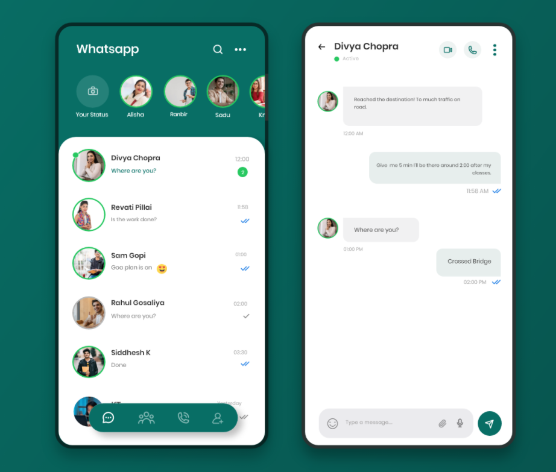
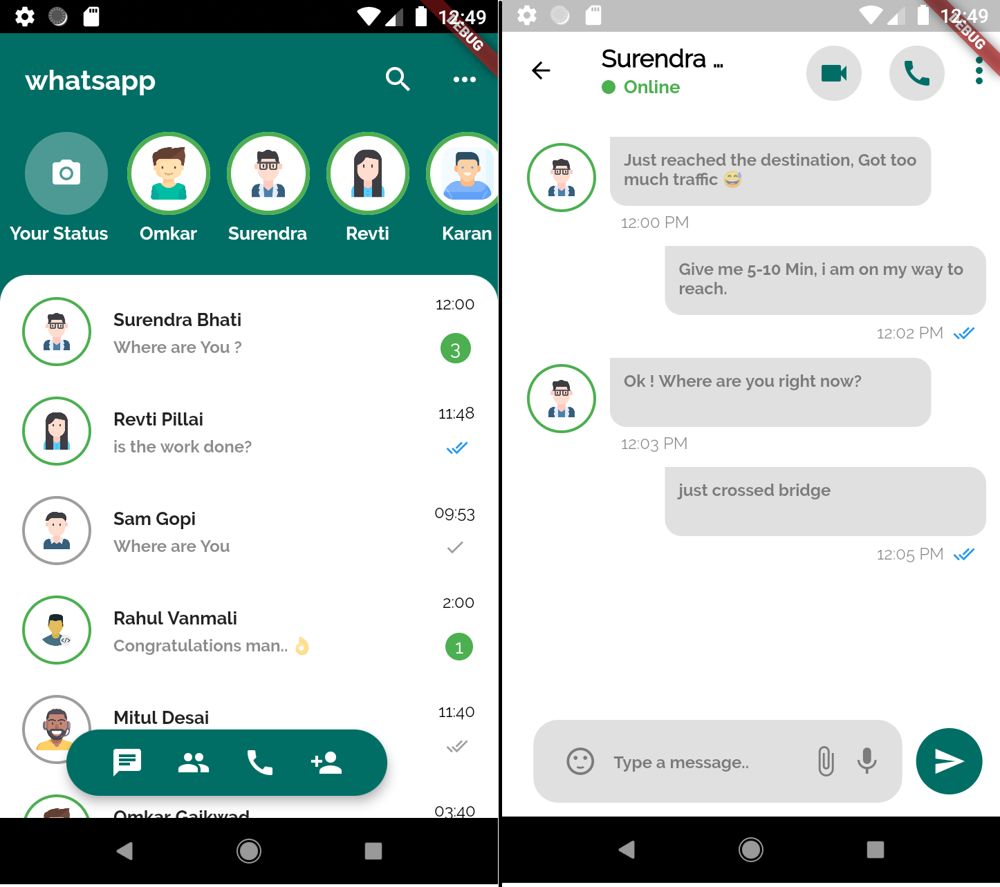

# WhatsApp Redesign UI

This Whatsapp UI redesign made in flutter :) 


Original Design        |  Flutter Version
:-------------------------:|:-------------------------:
  |    

## How to use

To clone and run this application, you'll need [Git](https://git-scm.com/downloads) and [Flutter](https://flutter.dev/docs/get-started/install) installed on your computer. From your command line:

```
# Clone this repository
$ git clone https://github.com/SurajLad/FlutterUI-Redesigns.git

# Go into the repository
$ cd WhatsApp_Redesign

# Install dependencies
$ flutter packages get

# Run the app
$ flutter run
```
## Credits
  - <a target="_blank" href="https://dribbble.com/shots/14231642-Whatsapp-Redesign">UI Design By Siddhesh Kanse</a>
  - <a target="_blank" href="https://www.flaticon.com">Graphics By FlatIcons</a>

If you like my work,then do support me by ⭐️ this repo if you like it.
